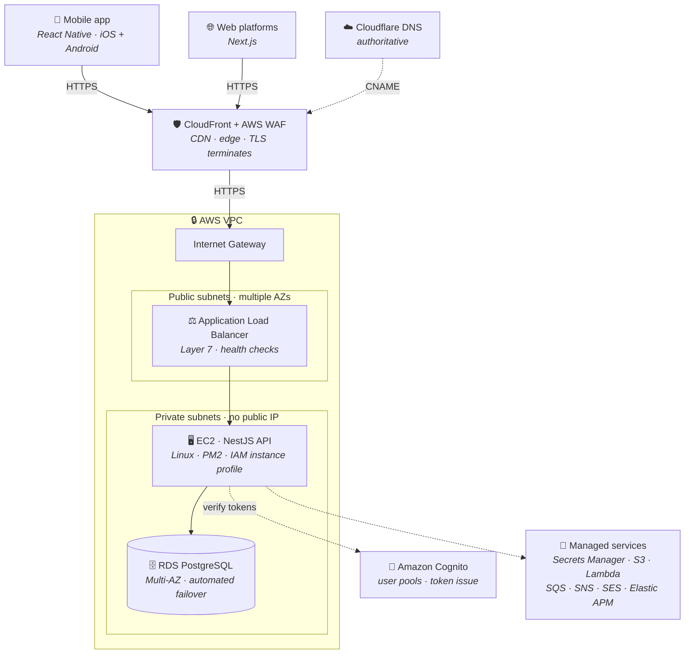
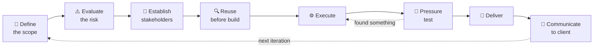

<div align="center">


<br />

[](https://www.linkedin.com/in/alex-jennings-software/)
[](mailto:aj0312@my.bristol.ac.uk)
[](#-beyond-the-terminal)
[](https://github.com/Alex90Jennings)

</div>

---

## 👋 `whoami`

```ts
const alex = {
  role:      "Full-Stack Developer @ ZIM Connections",
  since:     2022,
  building:  ["eSIM platforms", "React Native apps", "AWS infrastructure"],
  stack:     ["TypeScript", "React", "Next.js", "NestJS", "Node.js", "Python", "AWS"],
  studying:  ["AWS Solutions Architect Associate", "BSc Digital & Technology Solutions (Software Engineer)"],
  languages: ["English (native)", "Italian (B1, climbing)", "JavaScript (fluent, mostly)"],
};
```

An economics degree, then a bootcamp at the start of 2022, and I have been shipping production
software ever since. The work runs from the scoping call through the architecture diagram to the
pull request, and I genuinely like all of it. My favourite part is still the moment someone who has
never opened a terminal looks at the thing and says *"oh, that's actually really nice."*


---

## 🛠️ The stack

> **First, a principle.** If a cheap managed service does the job well, I will use it rather than
> write and maintain my own version. Holidu owns the booking calendar on Casalino, Appwrite owns auth
> and storage on two projects, Vercel owns the CDN. **No need to reinvent the wheel**, and every
> wheel I don't build is one I never have to patch at 2am. Custom code is for the part that is
> actually mine to solve.

<div align="center">

**Languages**


**Frontend**


**Backend**


**Data**


**Cloud & DevOps**


**Testing & tooling**


</div>

<table>
<tr>
<td width="50%" valign="top">

### 🏠 For personal projects

Optimised for **shipping this weekend**, not for a headcount.

- **Next.js / React**: App Router when the project wants SSR and SEO, Create React App when it genuinely doesn't
- **TypeScript**: increasingly non-negotiable
- **Appwrite**: auth, database and storage without writing a backend I'd then have to babysit
- **Tailwind CSS**: or hand-written CSS when the design deserves it
- **Vercel**: push to `main`, it's live, free tier, preview deploys on every PR
- **Terraform**: infrastructure as code for anything with more than one moving part
- **Neon / Render**: when a project genuinely needs Postgres and a server
- **GitHub Actions**: lint, typecheck, tests and build on every push, deploy only when green

</td>
<td width="50%" valign="top">

### 🏢 For enterprise

Optimised for **the 2am phone call never happening**.

- **NestJS on Node.js**: typed, modular, boring in the best way
- **PostgreSQL on RDS**: Multi-AZ, automated backups, point-in-time recovery
- **React Native**: one codebase, two app stores, one release process
- **AWS**: VPC, EC2, ALB, CloudFront, WAF, Lambda, S3, RDS, IAM, Route 53
- **Cloudflare**: authoritative DNS in front of the whole thing
- **Redis**: caching and the jobs that shouldn't block a request
- **Spring Boot**: where the JVM is the right answer
- **Docker + CI/CD**: reproducible, reviewable, reversible

</td>
</tr>
</table>


---

## 🚀 Projects

The platform I work on every day, then the things I built because I wanted them to exist. Every
one is deployed, and every one has a GIF, because a README that describes a UI instead of showing it
is a README that has given up.

<br />

### 📡 ZIM Connections: *eSIM platform, in production, in both app stores*

<div align="center">

[](https://apps.apple.com/us/app/zim-esim-calls-data-plans/id1611244114)
[](https://apps.apple.com/us/app/zim-sbb-esim-data-plans/id6469112236)
[](https://softbank.zimconnections.com/en/plans)
[](https://akwaabasim.com/en/plans)


</div>

My day job: a consumer eSIM platform selling international data, calls and connectivity plans, with
paying customers on it, a **React Native app on iOS and Android**, white-label web platforms for
partner brands including **Swiss Federal Railways (SBB)**, **SoftBank** and **Akwaaba**, and a
business dashboard behind all of it.
The backend is a set of separate **Node.js services**, a **NestJS** API, an **Express** provider
connector and a notifications service, each deployed and code reviewed on its own, talking over
**REST** and **WebSockets** (Socket.IO) where the client needs pushing rather than polling.

A **NestJS** API on **EC2** in private subnets, behind an application load balancer, behind
**CloudFront and AWS WAF**, with **Cloudflare** as authoritative DNS and **RDS PostgreSQL** running
Multi-AZ. The interesting engineering in white-labelling is not the theming. It is keeping
partner-specific behaviour out of the core, so that adding the *next* partner is a configuration
change rather than a fork.



**The cloud engineering, specifically**

| Area | What that means here |
| :-- | :-- |
| **High availability & disaster recovery** | RDS runs **Multi-AZ** with a synchronous standby and **automated failover**, backed by automated backups and **point-in-time recovery**. Multi-AZ buys availability, not scale, which is what a read replica is for. |
| **Network design** | Public and private subnets spread across multiple **Availability Zones**. The API holds **no public IP** and is reachable only through the load balancer. **Security groups** are stateful and reference each other rather than CIDR ranges; **NACLs** are stateless and need a rule in each direction. |
| **Identity & least privilege** | **Amazon Cognito** for end-user **authentication** and token issue, role checks for **authorisation**, **IAM instance profiles** and **STS** for short-lived auto-rotated service credentials, and **Secrets Manager** for the rest. No long-lived key on disk. |
| **Edge, CDN & security** | **ACM** issues the certificates. **CloudFront** answers from the nearest edge location with **AWS WAF** in front, so static assets never reach the origin. TLS terminates at the edge and again at the load balancer, keeping traffic **encrypted in transit** throughout. A managed rule overridden to **Count** observes without blocking, which is the trap worth knowing about. |
| **Observability & monitoring** | **Elastic APM** on the Node services and **RUM** in the browser, with traces, errors and latency in **Kibana**. |
| **Serverless & async** | **Lambda** and **SQS** for work that should never block a request, **SNS** and **SES** for push and email. |
| **Delivery** | **Docker**, **GitHub Actions** pipelines, **Bash** tooling, and **Linux** servers running the API under PM2. |
| **Cost optimisation** | Reading the bill is part of the job. Auditing my own account against **Cost Explorer** turned up an unattached volume, dead hosted zones and an unused secret, and removing them cut it by 99%. |


<br />

### 🛒 Total Guess: *guess the total, one basket a day*

<div align="center">
  
</div>

<div align="center">

[](https://www.total-guess.com)
[](https://github.com/Alex90Jennings/total-guess)
[](https://github.com/Alex90Jennings/total-guess/actions/workflows/ci.yml)


</div>

I used to add up the shopping in my head on the way round and commit to a number before the till. In
a Sainsbury's in 2009 I got it **exactly right, to the penny**, and nobody in the queue understood
why I was so happy. This is that habit turned into a daily game.

Ten real products, one guess each, the same basket for everyone, reset at midnight UTC. A
**seeded shuffle keyed to the day number** guarantees no repeats within a game and works through the
whole catalogue before any basket comes round again, which is 26 unique games. There are nine badges, a full
statistics panel with streaks and error bias, and an emoji-grid share that gives away your *shape*
but never the prices. Guest play is saved to the browser and migrated into your account if you
later sign up. Get more than 35% out and the game stops counting; it just files you in the column of
shame, visible from across the room.

It first ran on AWS, with the domain and its hosted zone in **Route 53**. Once the game was live it
was obvious the hosted zone and query charges were the entire bill for something with no revenue
behind it, so I moved DNS and hosting to a free tier and kept the domain. **Knowing when not to
reach for a managed service** is as much a part of cloud work as knowing how to wire one up.

<br />

### 🏡 Il Casino Casalino: *a real B&B, and the site built to fill it*

<div align="center">
  
</div>

<div align="center">

[](https://www.ilcasinocasalino.com)
[](https://github.com/Alex90Jennings/il-casalino)
[](https://github.com/Alex90Jennings/il-casalino/actions/workflows/ci.yml)


</div>

Client work for a four-room B&B in Francavilla Fontana, Puglia. The brief was narrow and sharp: make
the property look as good as it does in person, load fast on holiday Wi-Fi, and get a visitor from
*"this looks nice"* to an availability check **in one scroll**.

Video sells a stay in a way stills don't, so the engineering went into making it affordable: 4K
originals never reach the repo, a deterministic `ffmpeg` transcode caps everything at 1280px with no
audio track and `+faststart`, and every room clip lands **under 1 MB**. `LazyVideo` mounts a
`<video>` only when its slide is *both* active *and* on screen, so nothing heavy touches first paint
and `prefers-reduced-motion` visitors get a poster and a play button instead. Four rooms sit behind
four fine-line icons (sun, star, shell, moon) that read as a filter but behave as navigation, and
re-sync themselves when you swipe. Italian and English are resolved **server-side in middleware**, so
there is no flash of the wrong language. Booking hands off to Holidu at exactly the right moment,
which means no card data, no availability calendar to keep in sync, and no payment gateway to secure.

<br />

### 🎭 Operafy: *Spotify, but it only plays opera*

<div align="center">
  
</div>

<div align="center">

[](https://operafy-music.vercel.app)
[](https://github.com/Alex90Jennings/operafy-react)
[](https://github.com/Alex90Jennings/operafy-react/actions/workflows/ci.yml)


</div>

My **first ever HTML and CSS project**, built at bootcamp in 2022. The brief was to push CSS as far
as it would go, so I made a Spotify clone with one twist: it would only play opera, about which I
knew nothing. This is the project that got me hooked: the first one I set an alarm hours early for.
The play buttons played nothing and the playlists were typed into the markup, but it *looked* like
the real thing.

Four years later I went back and made everything that looked like it worked actually work. **31 real
recordings from 1896 to 1943** you can play, a full transport with shuffle, repeat, seek and volume,
accounts and persisted playlists on Appwrite with owner-only row permissions, real routes, search
across songs, operas, composers and singers, and a mobile layout that swaps the sidebar for a tab bar
and the player for a mini-player. Every recording and every cover is **public domain**, pulled from
Wikimedia Commons by a Python script: Caruso, Gigli, Ponselle, original Ricordi posters by
Hohenstein, Schinkel's 1815 *Zauberflöte* stage design. The in-app credits page links every file to
its source and licence. The copyrighted album sleeves went in the bin, along with the
Spotify logo.

And that, I said, was that. A finished project, left alone as a reminder of where I started.

I lied. The loading of the images and audio was taking far too long, because every file was hotlinked
straight from Wikimedia Commons: someone else's bandwidth, someone else's uptime, and a URL that
could change without warning and take the player down with it. So I went back a third time and built
the thing below.

<br />

### ☁️ operafy-infra: *the CDN behind Operafy, in Terraform*

<div align="center">

[](https://github.com/Alex90Jennings/operafy-infra)
[](https://github.com/Alex90Jennings/operafy-infra/actions/workflows/terraform.yml)


</div>

Operafy hotlinked its recordings from Wikimedia Commons, so the player broke whenever a file was
re-encoded and the bandwidth was somebody else's. This is the **infrastructure as code** that fixed
it: a private **S3** bucket behind **CloudFront**, with an **Origin Access Control** and a bucket
policy naming that one distribution, so the objects are unreachable any other way. Versioned,
**encrypted at rest**, and swept by a lifecycle rule, because versioning without expiry bills forever.

**State** lives in S3 with native lock files rather than a DynamoDB table. **CI** runs
`fmt`, `validate` and `plan` on every pull request, comments the plan back, and applies the
**reviewed plan artefact** on merge behind an approval gate, authenticating through **GitHub OIDC**
with **no AWS access key** anywhere in the repository. The deploy role is scoped to named ARNs and
cannot rewrite its own permissions. The provider pins `allowed_account_ids`, because this machine
also holds production credentials and a wrong profile should abort rather than apply.

Building it turned up a genuinely instructive bug: every role assumption was refused while the trust
policy looked correct, because this account emits a **customised OIDC subject claim** carrying the
numeric owner and repository IDs, which the documented pattern never matches. CloudTrail redacts the
parameters on a failed authorisation, so the answer only came from printing the token's own claims.
Pinning those immutable IDs is the harder-to-abuse form anyway. The write-up is in the README.

While I was in the account I audited it against Cost Explorer and removed **$28 a year** of orphaned
resources: an 8 GB volume detached since 2023, dead hosted zones, an unused secret and two abandoned
API Gateways.

<br />

### 🎓 eSIM Admin Dashboard: *my first Python project, and a distinction-level brief*

<div align="center">
  
</div>

<div align="center">

[](https://agile-assignment.onrender.com)
[](https://github.com/Alex90Jennings/agile-assignment)
[](https://github.com/Alex90Jennings/agile-assignment/actions/workflows/ci.yml)


</div>

Built for **Software Engineering and Agile Assignment**, a Level 5, 20-credit module on my degree
apprenticeship, and my first time writing Python. Coming from JavaScript, the interesting part was
learning how **Flask** does things: blueprints instead of routers, **SQLAlchemy** models instead of
hand-written SQL, decorators for access control, pytest for everything.

Two roles, an admin approval gate for self-registered users, request-and-approve flows for eSIMs and
top-ups, structured request logging, and **384 passing unit and integration tests** behind a pipeline that runs the suite
on every push and redeploys `main` only when it's green. Planned with user stories, sprints and a
Kanban board, and the accompanying report is honest that the Agile practices were applied
informally rather than systematically, which is exactly the reflection the brief asked for.

> ⏱️ The demo sleeps on Render's free tier. First request takes ~50 seconds to wake it; after that
> it's quick. Consider it a loading screen with character.


---

## 🎓 Qualifications

<div align="center">


&nbsp;&nbsp;&nbsp;

&nbsp;&nbsp;&nbsp;


</div>

| | Qualification | Detail |
| :--: | :-- | :-- |
| ☁️ | **AWS Certified Cloud Practitioner** | Earned. The foundations: services, pricing, and the shared responsibility model. |
| 🤖 | **AWS Certified AI Practitioner** | Earned. Generative AI and ML on AWS, and where it genuinely belongs in a product. |
| 🏛️ | **AWS Certified Solutions Architect (Associate)** | **In progress.** Currently the reason my evenings look the way they do. |
| 💻 | **BSc Digital & Technology Solutions (Software Engineer)** | University of Roehampton, degree apprenticeship, 2024 to 2027. Software engineering, Agile, data, cybersecurity and cloud, studied while working full time on a production platform. The best of both: the theory on Monday, the production incident on Tuesday. |
| 📊 | **BSc Economics** | University of Bristol. Econometrics, modelling and the habit of asking *"compared to what, and at what cost?"*, which turns out to be the single most useful question in software architecture too. |


---

## 🧭 How I actually work

Four years of shipping to real clients taught me that the code is the easy part. This is the loop I
run on every piece of work, big or small:



| Step | What it means in practice |
| :-- | :-- |
| **🎯 Define the scope** | Write down what is in and, more importantly, what is out. Most project failures I have seen were scope failures wearing a technical costume. |
| **⚠️ Evaluate the risk** | What breaks, who it hurts, what it costs, and what the rollback looks like. Decided *before* the first commit, not during the incident. |
| **👥 Establish stakeholders** | Who signs off, who is affected, who has to maintain it at 2am. Surfacing the quiet stakeholder early is worth a week of rework. |
| **🔍 Reuse before build** | In order: search the codebase for something that already does this, then look for a service that does it well and cheaply, and only then write something custom. Every line I don't write is a line I never have to debug, document or migrate. Being **lazy in the right direction** is usually the best engineering decision available. |
| **⚙️ Execute** | Build it. Claude helps here, and I treat AI as a very fast, very literal pair programmer that still needs someone with judgement holding the wheel. |
| **🔨 Pressure test** | Tests, edge cases, and honestly trying to break my own work before a user does it for free. |
| **🚀 Deliver** | Shipped, monitored, documented. "It works on my machine" is a confession, not a status update. |
| **💬 Communicate to client** | In their language, not mine. Being the person who can explain a VPC to a non-technical stakeholder has been worth more to my career than any single framework. |


---

## 📊 GitHub

<div align="center">

**3,200+ contributions · 4 years on the platform · JavaScript, TypeScript, Python and Swift by commit volume**

<picture>
  <source media="(prefers-color-scheme: dark)" srcset="https://github-profile-summary-cards.vercel.app/api/cards/profile-details?username=Alex90Jennings&theme=github_dark" />
  
</picture>

<picture>
  <source media="(prefers-color-scheme: dark)" srcset="https://github-profile-summary-cards.vercel.app/api/cards/most-commit-language?username=Alex90Jennings&theme=github_dark" />
  
</picture>
<picture>
  <source media="(prefers-color-scheme: dark)" srcset="https://github-profile-summary-cards.vercel.app/api/cards/repos-per-language?username=Alex90Jennings&theme=github_dark" />
  
</picture>

<picture>
  <source media="(prefers-color-scheme: dark)" srcset="https://streak-stats.demolab.com?user=Alex90Jennings&hide_border=true&theme=tokyonight&ring=38BDAE&fire=FF9900&currStreakLabel=38BDAE" />
  
</picture>
<picture>
  <source media="(prefers-color-scheme: dark)" srcset="https://github-profile-summary-cards.vercel.app/api/cards/productive-time?username=Alex90Jennings&theme=github_dark&utcOffset=1" />
  
</picture>

</div>

<sub><em>The bulk of my commits sit behind private work repositories, so the graph above is the
hobby half of the picture. The enterprise half is in the App Store.</em></sub>


---

## 🌱 Beyond the terminal

<div align="center">

🥕 &nbsp;Growing vegetables &nbsp;&nbsp;·&nbsp;&nbsp; 🌭 &nbsp;Dachshund owner &nbsp;&nbsp;·&nbsp;&nbsp; 🔧 &nbsp;Building PCs

🇮🇹 &nbsp;Italian, B1 and chasing fluency &nbsp;&nbsp;·&nbsp;&nbsp; 🥾 &nbsp;Hiking

⚽ &nbsp;Football &nbsp;&nbsp;·&nbsp;&nbsp; 🏏 &nbsp;Cricket &nbsp;&nbsp;·&nbsp;&nbsp; ♟️ &nbsp;Chess &nbsp;&nbsp;·&nbsp;&nbsp; 📈 &nbsp;Trading and investing

</div>


---

> 🤖 **On AI, since everyone's asking.** I use Claude daily and I am not coy about it. It sits in
> the **Execute** step of the loop above, and it earns its place. What it doesn't do is decide the scope,
> weigh the risk, or explain a design to a client who's paying for it. Those are the parts of this
> job I actually enjoy, and the parts that decide whether software is any good.

---

<div align="center">

### 💬 Get in touch

I'm always happy to talk about **AWS architecture**, **React and React Native**, whether cricket is
a sport or a lifestyle, and what you should be planting this month.

[](https://www.linkedin.com/in/alex-jennings-software/)
[](mailto:aj0312@my.bristol.ac.uk)

<br />

<sub><em>⭐ If something here was useful, a star costs nothing and makes my day.<br />
🌭 No dachshunds were disturbed in the making of this README. She slept through all of it.</em></sub>


</div>
